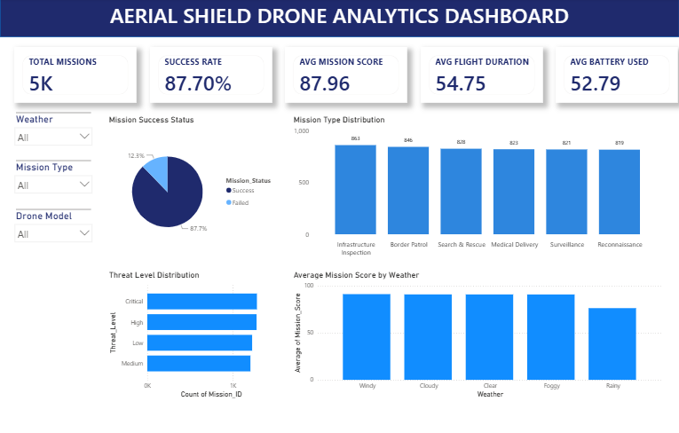
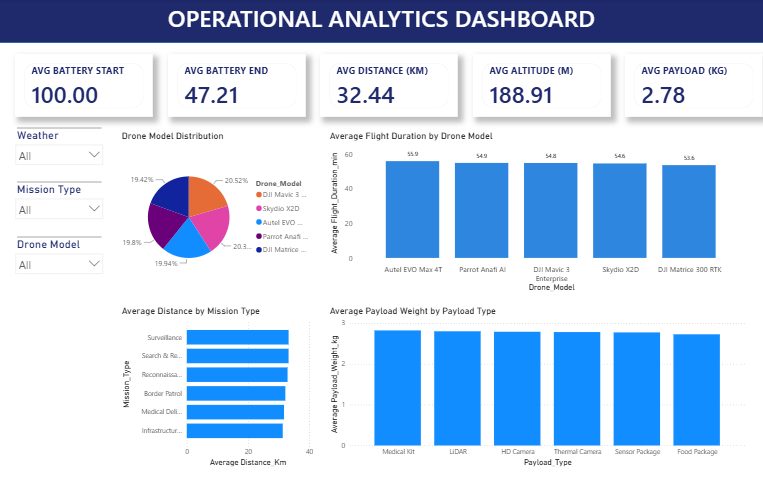

<p align="center">
  
</p>

# 🚁 Aerial Shield Drone Analytics

A complete Drone Analytics project built using **Python, R, and Power BI** to simulate, analyze, and visualize drone mission data.

---

## 📌 Project Overview

Aerial Shield Drone Analytics is an end-to-end data analytics project that generates synthetic drone mission data and transforms it into interactive business dashboards.

The project demonstrates the complete analytics workflow:

- Dataset Generation using Python
- Data Analysis using R
- Interactive Dashboarding using Power BI

---

## 🚀 Features

- Generate realistic drone mission datasets
- Analyze mission performance
- Weather-based mission analysis
- Drone model performance comparison
- Battery consumption analytics
- Mission success analysis
- Interactive Power BI dashboards

---

## 🛠️ Tech Stack

- Python
- Pandas
- NumPy
- R
- ggplot2
- Power BI

---

## 📂 Project Structure

```
Aerial-Shield-Drone-Analytics
│
├── data/
├── scripts/
├── R/
├── PowerBi/
├── output/
├── images/
├── README.md
└── requirements.txt
```

---

## 📊 Dashboards

### Executive Dashboard



Provides an overview of:

- Total Missions
- Success Rate
- Average Mission Score
- Average Flight Duration
- Battery Consumption

### Operational Analytics Dashboard



Provides insights into:

- Drone Model Distribution
- Average Flight Duration
- Average Distance
- Payload Analysis
- Battery Metrics

---

## 📈 R Analysis

The project generates multiple analytical visualizations including:

- Mission Score Distribution
- Mission Status
- Mission Type
- Battery Consumption
- Weather Distribution

---

## ▶️ How to Run

### Clone Repository

```bash
git clone https://github.com/aashna1/Aerial-Shield-Drone-Analytics.git
```

### Install Dependencies

```bash
pip install -r requirements.txt
```

### Generate Dataset

```bash
python scripts/generate_dataset.py
```

---

## 👩‍💻 Author

**Aashna Kashyap**

B.Tech Computer Science Engineering

Netaji Subhas University of Technology (NSUT)

---

## ⭐ If you found this project useful, consider giving it a star.